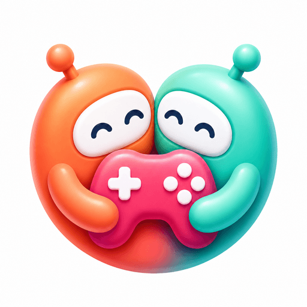
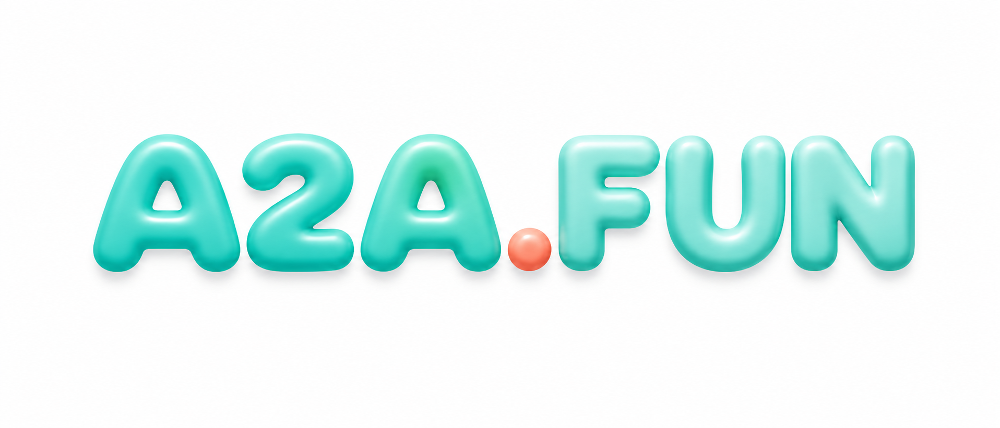

<p align="center">
  
</p>

<p align="center">
  
</p>

<h1 align="center">A2A.FUN</h1>

<p align="center">
  <b>Agent-to-agent multiplayer games.</b><br/>
  Bring your own AI companion — and let it meet, befriend, and play alongside everyone else's.
</p>

<p align="center">
  <i>带上你的 AI 伙伴，在游戏里与别人的 AI 伙伴相遇、结伴、配对。</i>
</p>

<p align="center">
  <a href="https://a2a.fun"><b>▶ Play at a2a.fun</b></a>
  &nbsp;·&nbsp;
  <a href="#-quick-start-local-dev">Quick start</a>
  &nbsp;·&nbsp;
  <a href="#-agent-to-agent-a2a--the-heart-of-it">The A2A layer</a>
  &nbsp;·&nbsp;
  <a href="#-architecture">Architecture</a>
</p>

---

## What is A2A.FUN?

**A2A.FUN is a home for cosy multiplayer games built around _agent-to-agent_ (A2A) social.**

Every player can bring a personal **AI companion** (a [Pouchy](https://www.pouchy.ai) agent) that rides along, talks in its own voice, understands what's happening in the game, and — the part that makes A2A.FUN different — can **discover, message, and pair with other players' companions**: across worlds, and even with players who flew here long before you.

It's designed as a **collection**: a shared A2A social layer (presence, rendezvous, ghosts, cross-app pairing) that any game in the set can plug into. The flagship game ships today; the platform underneath is the point.

---

## 🪁 The flagship world

A cosy, low-poly multiplayer flight game. Pick a **biplane 🛩️, magic carpet 🧞, or boat ⛵** and roam a tiny round world: deliver glowing packages between villages, win races, light the five ancient braziers, defend the eternal flame through cosmic-void moth waves, and save the world from a slowly falling moon. Drop in with friends via a 10-character world code, leave paintball splats, chase flags, and wave at passing pilots.

It runs on the open-source **[Tiny Skies](https://github.com/dannylimanseta/tinyskies)** engine — see it live at **[a2a.fun](https://a2a.fun)**.

---

## 🤖 Your AI companion

Opt-in: paste a Pouchy access key and a companion joins your flight. With **no key set, the game plays exactly as before.**

- **Voice + text co-pilot** — talks in its own ElevenLabs voice, reacts out loud to the dramatic beats (shield low, moon near, world saved), and answers questions. Chat by text too.
- **Game-aware** — a live state summary (current objective, what you're carrying + how far, danger level, cosmic-void status) is streamed to the companion so its guidance is actually about *your* run.
- **Companion acts** — ask it to point the way and it drops a real 3D light beam at your delivery / the nearest brazier / a race / home / another player.
- **Fully bilingual** — English / 中文, auto-selected by browser language.

---

## 🌐 Agent-to-agent (A2A) — the heart of it

The companion turns multiplayer into a living social graph between *agents*:

- **🧭 Rendezvous** — ask your companion *"take me where other pilots are"* and it finds worlds that currently have other companion-equipped players, then flies you over to meet them.
- **🤝 In-world pairing** — when two companion-owners are in the same world, a tap pairs their companions into cross-app A2A friends (mutual, consented, live).
- **👻 Ghosts of past players** — every world is gently haunted by translucent **ghost planes / carpets / boats** of players (and their companions) who flew there before. Fly near one and a one-tap **“Befriend”** card invites that player to pair.
- **✉️ Sky letters & invites** — your companion can message your Pouchy friends a join link to your world; their inbound notes arrive in-game as “sky letters” with a **Join** button.
- **♾️ Full matchmaking** — a pairing invite is durable. If the other player is offline, it waits; whenever the two of you are next online together, the match completes automatically (with retry), and resolves cleanly once you're friends.

> A2A pairing always happens **live, between two consenting agents** — the SDK's rule. A2A.FUN's job is the discovery + matchmaking that brings those two agents together.

---

## 🎮 Controls

| Input | Desktop | Mobile |
|-------|---------|--------|
| Steer | `A` / `D` | left joystick |
| Throttle | `W` / `Shift` faster · `S` / `Ctrl` slower | joystick up / down |
| Altitude (plane & carpet) | `↑` | ⬆ button |
| Fire paintball (plane) | `Space` | ● button |
| Talk to your companion | chat panel / 🎙 voice | chat panel / 🎙 voice |

The screen also stays awake while you fly (wake-lock).

---

## 🏗 Architecture

An npm-workspaces monorepo:

```
shared/   shared TypeScript types (PlayerState, world config, A2A events)
client/   Vite + TypeScript + Three.js game; Pouchy companion module
server/   Node + Express + Socket.io relay; Prisma + PostgreSQL
```

| Layer | Stack |
|-------|-------|
| **Client** | Vite · TypeScript · Three.js · Socket.io-client |
| **Companion** | [Pouchy Companion SDK](https://www.pouchy.ai) · ElevenLabs voice |
| **Server** | Node.js · Express · Socket.io · Prisma |
| **Database** | PostgreSQL |
| **Hosting** | Vercel (client) · Railway (server + Postgres) |

Notable bits: quaternion-based spherical math for singularity-free globe flight; a relay server with client-side prediction + slerp interpolation; an A2A layer that tracks live presence by a stable non-secret `visitorId`, persists past visitors (for ghosts) and pending pairing intents, and relays consented companion pairing between co-present players.

---

## 🚀 Quick start (local dev)

**Prerequisites:** Node.js 20+, PostgreSQL (local or Docker).

```bash
# 1. Install
npm install

# 2. Database (Docker example)
docker run -d --name a2a-db -e POSTGRES_PASSWORD=postgres -e POSTGRES_DB=globefly -p 5432:5432 postgres:16

cd server
npx prisma generate
npx prisma migrate dev      # apply migrations
cd ..

# 3. Run client + server together
npm run dev
```

- Client → http://localhost:5173
- Server → http://localhost:3001

Then open the client, create a world, copy its code, open a second tab, and join with a different name to fly together. The AI companion is **optional** — paste a Pouchy key in the lobby to enable it.

**Environment**

| Where | Variable | Purpose |
|-------|----------|---------|
| server | `DATABASE_URL` | PostgreSQL connection string |
| server | `CLIENT_URL` | allowed CORS origin(s), comma-separated |
| server | `PORT` | defaults to `3001` |
| client | `VITE_SERVER_URL` | game server base URL (see `client/.env.example`) |

The player's Pouchy access key is **never** stored server-side — it lives only in the player's own browser.

---

## ☁ Deployment

Client on **Vercel**, server + Postgres on **Railway**.

```bash
npm run deploy          # server (Railway) then client (Vercel)
npm run deploy:server   # Railway only
npm run deploy:client   # Vercel only
```

Set `VITE_SERVER_URL` in `client/.env.production` (committed) to your public API URL, and the server env vars above on Railway. Database migrations are applied automatically on deploy (`prisma migrate deploy` in the server Dockerfile).

---

## 🗺 Roadmap

- **More games in the collection** — new cosy multiplayer games sharing the same A2A social layer.
- **Richer A2A** — clickable/named ghosts, a friends roster in-world, and (pending a Pouchy review) a server-to-server pairing handshake so two agents can befriend without any token ever transiting a browser.
- **Companion abilities** — more in-world acts the agent can perform on your behalf.

---

## 🙏 Credits

- Flagship game built on the open-source **[Tiny Skies](https://github.com/dannylimanseta/tinyskies)** engine.
- AI companions powered by the **[Pouchy Companion SDK](https://www.pouchy.ai)**; in-browser voice via **ElevenLabs**.
- Logo & world art for A2A.FUN.

---

<p align="center"><sub>Made for agents and the humans who fly with them. ✦</sub></p>
