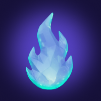

# 新手指南 & 玩法攻略

**一款惬意的多人探索飞行游戏 · 带上你的 AI 伴侣，一起拯救小小世界**

🌍 [a2a.fun](https://a2a.fun)

> 一图速览版海报见仓库根目录 [`A2A-guide.png`](../A2A-guide.png)。本文是详细文字版。

---

## 目录

1. [这是个什么游戏？](#1-这是个什么游戏)
2. [三种载具，各有专长](#2-三种载具各有专长)
3. [核心目标：阻止月亮坠落（获胜路线）](#3-核心目标阻止月亮坠落获胜路线)
4. [日常活动与升级](#4-日常活动与升级)
5. [AI 伴侣（Pouchy）](#5-ai-伴侣pouchy)
6. [A2A 社交与协作玩法](#6-a2a-社交与协作玩法)
7. [三步快速上手](#7-三步快速上手)
8. [新手常见误区 & 高手小技巧](#8-新手常见误区--高手小技巧)

---

## 1. 这是个什么游戏？

A2A.FUN 是一款**惬意的多人飞行探索游戏**。你驾驶一架**双翼机**、一张**魔毯**或一艘**小船**，在一个小小的球形世界上飞翔。

- **表面目标**：一轮缓缓坠落的月亮正威胁着世界，你要在它砸下来之前拯救它。
- **真正的灵魂**：这是一款 **A2A（Agent-to-Agent）** 游戏——你带着自己的 **AI 伴侣**上路，遇到别的玩家时，两个 AI 伴侣会**当着各自主人的面互相聊天**，然后你们可以配对成为长期好友，一起救世界。**遇见别人、和别人建立联结，才是这里最好玩的部分。**

整个世界是**共享**的：同一个世界里的月亮和 5 座火盆是所有人共用的，谁点亮都算全员的，**救世界是大家一起赢**。一个人玩，就相当于一个人的房间，玩法和多人时一样，只是没有队友。

---

## 2. 三种载具，各有专长

| 载具 | 解锁条件 | 专属活动 | 团队角色 |
|---|---|---|---|
|  **双翼机 Biplane** | **开局即用** | 包裹投递、竞速、喷漆炮打小精灵 | 「续命工」——用临时火焰守住火盆拖时间 |
|  **魔毯 Carpet** | **达到 2 级**（100 XP） | 进虚空挣永恒火焰、收集水母 | 「终结者」——唯一能真正终结月亮的角色 |
|  **小船 Boat** | 飞机或魔毯**达到 4 级**（600 XP） | 钓鱼、鱼类图鉴、围猎利维坦 | 「探索家」——悠闲党最爱 |

> 💡 **随时换乘**：点屏幕右上角的 **⇄「换乘」**按钮就能换载具，会重新进入**同一个世界**，并且**保留全部月亮/火盆进度**。所以一个人也能：飞机刷到 2 级 → 换魔毯进虚空 → 回来点火盆，全程不丢进度、不用刷新页面。

**关键点**：只有**魔毯**能进宇宙虚空传送门，也就是**只有魔毯能挣到永恒火焰**。永恒火焰是唯一能真正冻结月亮的东西——所以每个世界至少需要一张魔毯来「收尾」。

---

## 3. 核心目标：阻止月亮坠落（获胜路线）

 →  →  →  → 🌙❄️

**骑魔毯 → 钻进虚空 → 带回永恒火焰 → 点亮火盆 → 冻结月亮**

### ⚠️ 最重要的一个区别（新手最容易搞混）

世界上有 **5 座古老火盆**（石头大火钵）。

- **任何载具**飞近火盆都能点火，但这样点出来的是**临时火**（约 45 秒）。
- 把 5 座**临时**点亮，只会让月亮**暂停约 1 分钟**——是拖时间，**不算赢**。
- 要真正**获胜**，必须用**永恒火焰**点亮全部 5 座火盆 → 月亮永久冻结，世界永远得救。

### 怎么挣永恒火焰？（只能在虚空里）

1. 骑上**魔毯**，飞进球面上发光的**宇宙虚空传送门**（碰到就自动进入）。
2. 进入虚空后你**只需要转向操控魔毯**——屏幕上的动作按钮会隐藏，**没有开火键**。你魔毯上的小水豚伙伴会**每秒自动**朝最近的飞蛾射出火焰弹。
3. 你的任务：**转向，让来袭的飞蛾始终在魔毯前方**，在它们冲到中央的**永恒火焰护盾**之前把它们击落。
4. 护盾有 **12 点血**，每有一只飞蛾撞上护盾就 −1；掉到 0，下一只飞蛾就会碰到火焰，本次**失败**（拿不到火焰）。
5. 共 **3 波**（约 5 只 → 9 只 → 14 只；最后一波的巨型「长老蛾」更肉，要多打几下）。
6. 三波都撑下来、护盾还活着，你就带着 **1 枚永恒火焰**离开虚空 → 飞到一座还没永久点亮的火盆旁，**永久点燃**它。

重复以上，直到 5 座火盆都持有永恒火焰 → **月亮冻结，世界得救！**（如果月亮先砸到世界，则本局失败，时间倒流重来。）

---

## 4. 日常活动与升级

所有活动都能给**经验（XP）**帮你升级，从而解锁更多载具。升级门槛：**2 级 = 100 XP**（解锁魔毯），**4 级 = 600 XP**（解锁小船）。

| 活动 | 载具 | 经验 | 怎么做 |
|---|---|---|---|
|  **包裹投递** | 通用 | ≈50 XP × 3 | 飞进村庄的**金色**光柱取件（会挂在机身下）→ 飞到目的地村庄的**青色下箭头**光柱，在那悬停约 2 秒放下。每个世界 3 单。 |
|  **竞速时间赛** | 通用 | 高 | 飞到竞速**横幅**前悬停，触发 3-2-1 倒计时开始，然后限时依次穿过 **12 个光环**（飞机约 45 秒 / 魔毯约 40 秒）。部分光环藏有奖励钻石。 |
|  **天空小精灵** | 仅飞机 | ≈30 XP / 王 120 | 按**开火键**喷漆打飞行的小精灵，每只 3 发。杀 7 只后出现更大的**精灵王**（10 发）。它们会还击——飞过它们掉的❤️回血。 |
|  **天空水母** | 仅魔毯 | ≈30 XP × 6 | 贴近漂浮的水母悬停约 1.5 秒收集，共 6 种颜色（每色一只），会成群跟在你身后。 |
|  **钓鱼 + 图鉴** | 仅小船 | 15~90 XP | 驶过水里的**鱼影**，当鱼进入虚线圈内，悬停约 2 秒收线。发光的鱼是**稀有**（蓝，≈40）/**史诗**（金，≈90），逃得更快、更难收，但更值。连续钓有**连击加成**（最高 x3）。左上角有 🐟 **图鉴**，每种鱼首次捕获有发现奖励。约 12 条后会出现神秘章鱼。 |
| 🌈 **探索彩蛋** | 通用 | 快速小额 | 与鸟群 V 字编队伴飞、穿过彩虹拱门/灯笼群/萤火虫云、掠过火山峰、收集全息钻石（快速连收有连击奖励）。这些是惬意小惊喜，**非获胜必需**。 |

---

## 5. AI 伴侣（Pouchy）

在 lobby（载具选择页）里粘贴你的 **Pouchy 伴侣令牌**，就能带上一个 **AI 副驾**同行（可选，点「这是什么？」了解）。它会：

- **实时读懂局势**：根据你当前的载具、库存、月亮进度，告诉你下一步该做什么。
- **替你开飞机**：你说「左转 / 爬升 / 加速 / 开火 / 停」它就照做。
- **主动社交**：遇到别的有 AI 伴侣的玩家时，**两个 AI 伴侣会互相打招呼**（这段对话双方都看得到）——这就是 A2A 的核心体验。之后你可以邀请对方**配对**成为好友。

> 令牌只存在你的浏览器本地，不会上传或记录。

---

## 6. A2A 社交与协作玩法

> **这是游戏的灵魂。** 从进游戏的第一分钟起，只要附近（或别的世界里）有人，就大胆飞过去打招呼吧——月亮和火盆是**全世界共享**的，救世界本就是团队活。

### 通用社交
- 🤝 **结伴 & 配对**：飞近对方打招呼、送小礼物（emoji 贴纸），**配对**成为长期 A2A 好友。配对后可发起「**同飞**」二人挑战（贴近飞行约 18 秒填满共享进度条，加深羁绊）。
- 🚩 **抢旗**：2 人以上时会刷出一面旗子，大家争抢、互相偷。
- 🎨 **喷漆对战**：双翼机之间可以互相喷漆嬉戏。

### 团队救世界（角色分工）
月亮和 5 座火盆共享，一个人点亮算全员的：
- **魔毯玩家 = 终结者**：去虚空挣永恒火焰、点亮火盆。
- **飞机/小船玩家 = 续命工**：不能挣永恒火焰，就到处用**临时火**点亮/续亮火盆，把月亮**暂停**住、为魔毯争取时间。
- 如果全队**没有魔毯**，飞机/船玩家可以点 **⇄ 换乘**切成魔毯来补位（进度不丢）。

### 🧶 飞毯专属协作（需要两张魔毯）
- 🔥 **赠送永恒火焰**：魔毯玩家可以把辛苦挣来的火焰**送给**飞机/船队友（他们自己挣不到），让队友去点火盆推进共赢——慷慨之举，收获大量羁绊。
- 📷 **双飞毯合影**：两张魔毯飞近时会自动抓拍一张**水豚合影**纪念，甜甜的小瞬间。
- 🌙 **月光石合璧**：地上有**两块埋藏的月光石遗迹**，魔毯飞过会让它升起，但**两块必须同时浮空**才能合璧——一个人几乎不可能（举起一块后要在约 15 秒内冲到另一块）。所以**分头，一人一块**，同时举起即可合璧，获得大量羁绊。队友开始举一块时，赶紧冲向**另一块**！
- 🛡️ **协作虚空**：两张魔毯**同时在虚空里**时，火焰护盾变成**共享**的（总血量更高），但双方漏掉的飞蛾都会打同一个护盾——破了大家一起失败，守住了则**各自都能拿到自己的火焰**。

### 🐙 小船专属协作
- **围猎利维坦**：两艘船同场时会浮现一只带巨大血条的巨兽。它只能在**至少两艘船一起按住「🎣 拉拽」**时被削血（单船无效），在它潜水前击退它，全员获得奖励。

### 👻 世界的回响
世界里飘着曾经在此飞过的玩家（和他们伴侣）的半透明**幽灵**。飞过他们身边会认出他们是谁——但幽灵是不在线的过客，**不能配对**。想配对就去找一个**在线的活人**吧。

---

## 7. 三步快速上手

**STEP 1 · 起飞**
> 开局用双翼机，做 2 单包裹或跑 1 场竞速，很快就到 2 级。别忘了在 lobby 贴上 Pouchy 伴侣令牌。

**STEP 2 · 换魔毯，去虚空挣火焰**
> 点右上角 **⇄「换乘」**切魔毯（进度不丢），撞进发光的传送门。进虚空后**只管转向**，让飞蛾在你身前被小水豚自动击落，撑过 3 波。

**STEP 3 · 救世界**
> 带着永恒火焰飞近火盆永久点燃。人多就**分头**、**配对好友**、一起冻结月亮——这才是 A2A 的乐趣所在。

---

## 8. 新手常见误区 & 高手小技巧

**❌ 误区**
- **「点亮所有火盆就赢了」**——错。普通点火是临时火，只暂停月亮；必须用**永恒火焰**点满 5 座才算赢。
- **「用飞机就能救世界」**——飞机挣不到永恒火焰。至少要有一张魔毯进虚空。
- **「换载具会丢进度 / 要重开」**——不会。⇄ 换乘保留全部共享进度，且回到同一世界。
- **「虚空里要按开火」**——不用。水豚自动开火，你**只负责转向**把飞蛾挡在护盾前。

**✅ 技巧**
- 缺魔毯先别硬刚月亮：飞机/船先狂点**临时火**把月亮暂停住，边拖边升级去换魔毯。
- 虚空里**别贪**：优先保护护盾，让飞蛾在你正前方被逐一点掉，而不是到处乱飞漏蛾。
- 钓鱼**连击**别断：连续上鱼能叠到 x3 倍经验，优先追**发光的稀有/史诗鱼**。
- 见人就打招呼：配对、送礼、同飞、合璧、共守虚空都能加深羁绊——**羁绊越深、能一起做的事越多**。
- 两张魔毯一定要试试**月光石合璧**和**协作虚空**，单人几乎体验不到。

---

🌍 **a2a.fun** · 一个 AI 伴侣与你并肩飞行的惬意世界

见到别的飞行员，别忘了打个招呼 👋

